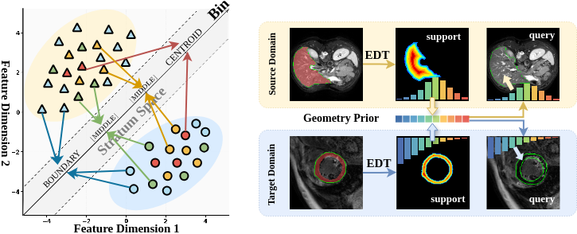

# Geometric-aware prototype learning for cross-domain few-shot medical image segmentation
[Neurips'26 submitted]


<div align="center">
  
  <p><em>Despite substantial appearance differences across imaging domains, the geometric structure of each organ, encoded as ordinal strata from boundary to centroid via EDT, remains consistent within each domain across individuals.</em></p>
</div>

**Abstract**:

Cross-domain few-shot medical image segmentation (CD-FSMIS) requires a model to generalise simultaneously to novel anatomical categories and unseen imaging domains from only a handful of annotated examples. 
  Existing prototypical approaches inevitably entangle anatomical structure with domain-specific appearance variations, and thus lack a stable reference for reliable matching under domain shift. We observe that the geometric structure of human anatomy constitutes a reliable, domain-transferable prior that has been overlooked. 
  Building on this insight, we propose GeoProto, a geometry-aware CD-FSMIS framework that enriches prototypical matching with explicit structural priors. The core component, Geometry-Aware Prototype Enrichment (GAPE), augments each local appearance prototype with a learned geometric offset encoding its ordinal position within the organ's interior topology. This offset is derived from an auxiliary Ordinal Shape Branch (OSB) trained under an ordinally consistent objective that enforces monotonic variation of geometric embeddings across interior strata, requiring no annotation beyond standard segmentation masks. Extensive experiments across seven datasets spanning three evaluation settings (cross-modality, cross-sequence, and cross-context) demonstrate that GeoProto achieves state-of-the-art performance.

**NOTE: We are actively updating this repository**

### Dependencies

Please install essential dependencies (see `requirements.txt`) 

```
dcm2nii
json5==0.8.5
jupyter==1.0.0
nibabel==2.5.1
numpy==1.15.1
opencv-python==4.1.1.26
Pillow==7.1.0 
sacred==0.7.5
scikit-image==0.14.0
SimpleITK==1.2.3
torch==1.3.0
torchvision==0.4.1
scipy==1.17.1
```

### Data pre-processing 
Please download train data as follows:
1) **Abdominal MRI**: [Combined Healthy Abdominal Organ Segmentation dataset](https://chaos.grand-challenge.org/)
2) **Abdominal CT**: [Multi-Atlas Abdomen Labeling Challenge](https://www.synapse.org/#!Synapse:syn3193805/wiki/218292)
3) **Cardiac LGE and b-SSFP**: [Multi-sequence Cardiac MRI Segmentation dataset](https://zmiclab.github.io/zxh/0/mscmrseg19/index.html)

For other test data, you can find them [here](https://drive.google.com/). 

Pre-processing is performed according to [Ouyang et al.](https://github.com/cheng-01037/Self-supervised-Fewshot-Medical-Image-Segmentation/tree/2f2a22b74890cb9ad5e56ac234ea02b9f1c7a535) and we follow the procedure on their GitHub repository.

### 🔥 Training and Inference
1. Compile `./data/supervoxels/felzenszwalb_3d_cy.pyx` with cython (`python ./data/supervoxels/setup.py build_ext --inplace`) and run `./data/supervoxels/generate_supervoxels.py`
2. run `./train.py` and `./test.py`

The results should be easy to re-produce by following the steps described above. 
We will publish our model weights when accepted.

### Acknowledgement
Our code is built upon the works of [SSL-ALPNet](https://github.com/cheng-01037/Self-supervised-Fewshot-Medical-Image-Segmentation), [ADNet](https://github.com/sha168/ADNet).
Should you have any further questions, please let us know. Thanks again for your interest.

